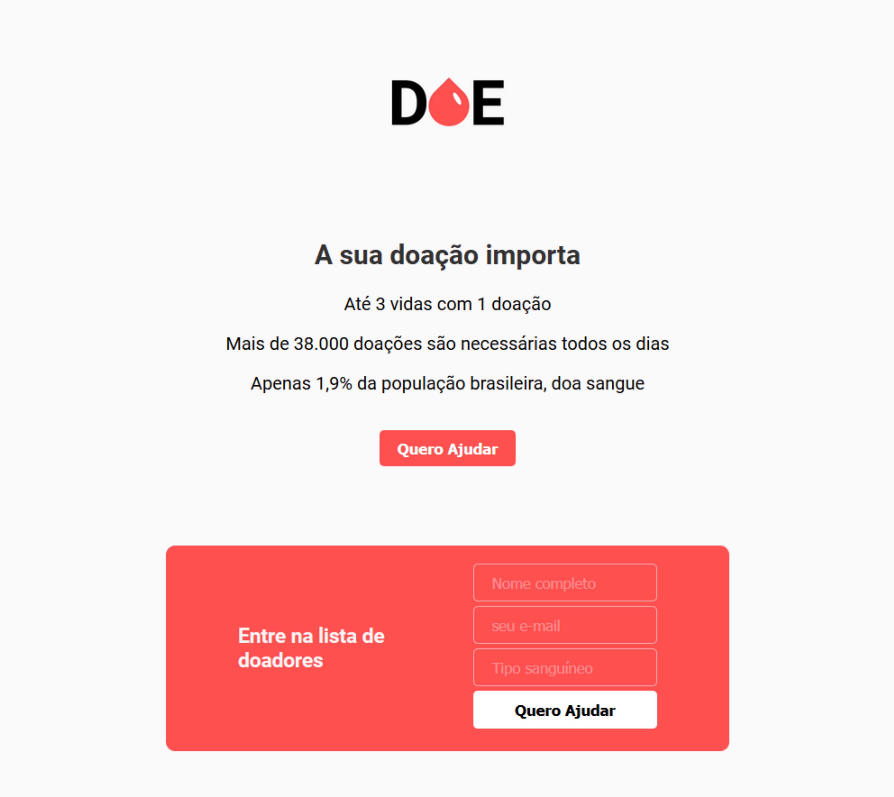
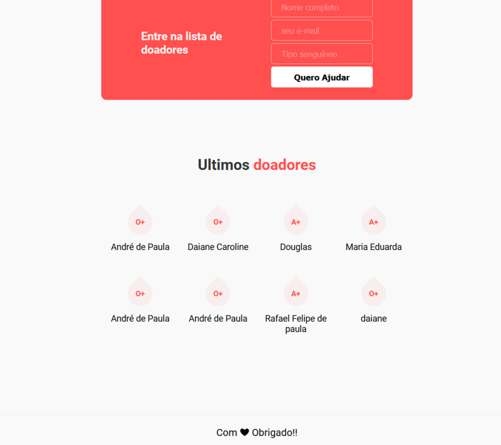

# MaratonaDev03

Projeto desenvolvido durante o mini curso Maratona Dev 03 da RocketSeat com a finalidade de aprendizado
no intuito de desenolver em dois dias uma aplicação web do zero utilizando tecnologias e ferramentas que estão 
em alta no mercado.

# Arquitetura

Por se tratar de uma aplicação simples, apenas uma página, sua arquitetura foi idealizada com o Frontend sendo construído em HTML e CSS e o Backend construído em Nodejs com a integração do bando de dados Postgres.

# Interface da Aplicação

A aplicação funciona de forma muito simples, clicando no botão **Quero ajudar** o formulário se abre e assim quando uma pessoa se cadastra, 
essa informação é enviada e armazenada no bando de dados e depois recuperada e exibida na seção de últimos doadores.

#### Lista de doadores

